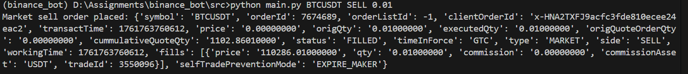
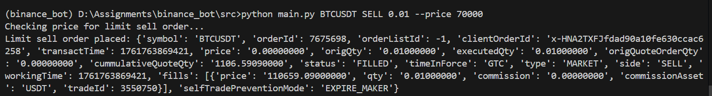
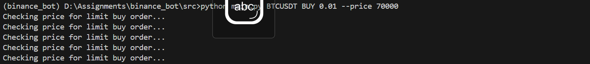

## Python Binance Bot
This project is a simple Binance trading bot that allows users to place market and limit orders via command-line arguments. It leverages the Binance API for executing trades.
### Features
- Place market buy and sell orders



- Place limit buy and sell orders
  
   
### Requirements
- Python 3.7+
- `binance` Python package
### Installation
1. Clone the repository:
   ```bash
   git clone
   cd binance-bot
2. Activate virtual environment 
# For Windows
```bash
python -m venv venv
venv\Scripts\activate
```
# For macOS/Linux
python3 -m venv venv
source venv/bin/activate
Install dependencies:

```bash
   pip install -r requirements.txt
